# Active-Directory-Home-Lab
 
<h2>Description</h2>
A full Active Directory Domain setup utilizng Windows Server 2025 domain controller and Windows 11 Enterprise workstation on VMWare Workstation with custom users, groups, and GPOs to simulate enterprise structures. The project will also demonstrate an attack on the enterprise system, followed by mitigation/remediation tactics and procedures. The project is ocean-themed :))
<h2>Disclaimer</h2>
This repository contains solutions and writeups for various Capture The Flag (CTF) challenges. The content is provided strictly for educational, research, and self-training purposes. DO NOT use this information to attack, compromise, or disrupt any system, network, or application without prior, written authorization. Engaging in unauthorized access is illegal and unethical.
<h2>Project Overview</h2>
<b>Microsoft Evaluation Center ISO Files</b>

  - Windows Server 2025 - https://www.microsoft.com/en-us/evalcenter/evaluate-windows-server-2025
 
  - Windows 11 Enterprise - https://www.microsoft.com/en-us/evalcenter/evaluate-windows-11-enterprise
 
 
Just enter a bunch of dummy data for the user information requirements and you should be able to download the ISOs afterwards. 
 
 
The screenshots below will cover main components configured on the AD. The project currently work in progress with setting up the environment as a CTF. Attacks and mitigations will be present soon!!
 
<h2>Project Screenshots</h2>

After installion, we have the server running, however, it's not a Domain Controller yet. Here, I'll add the needed domain services roles, create a forest with a root domain called 'deepblue.local', and rename the server to 'DeepBlue-DC':  
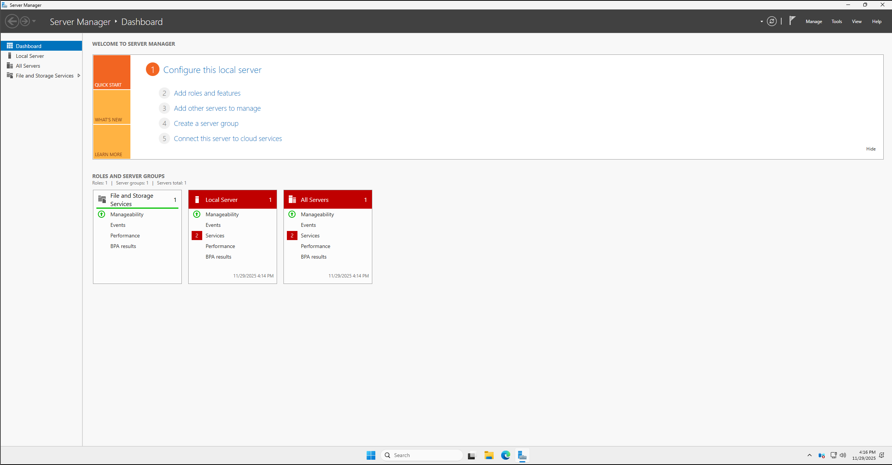
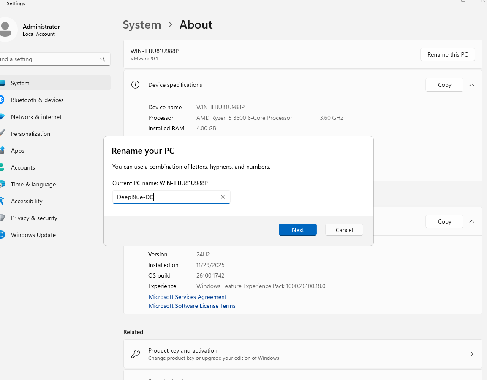
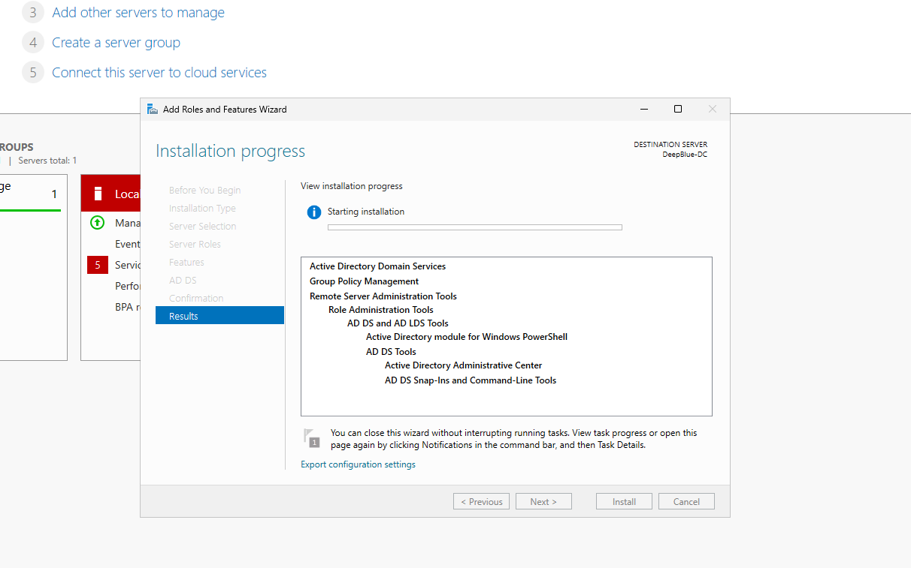
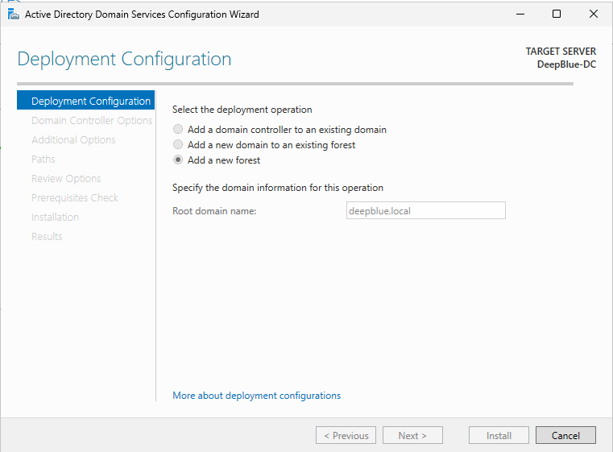
 
 
 
As you can see, the server is now a domain controller based on the login screen:  
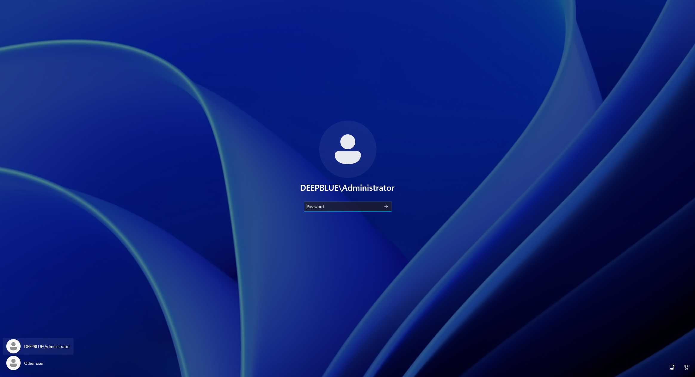
 
 
 
Next, I'll add AD Certificate Services & Certificate Authority for cryptographic trust and security within our domain:  
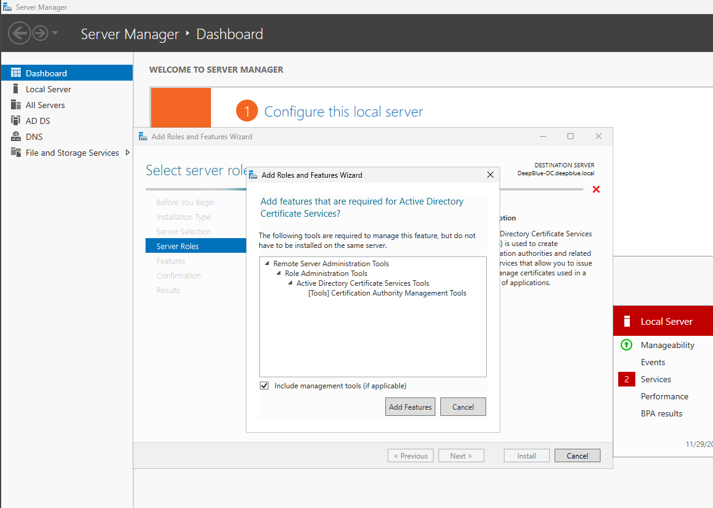
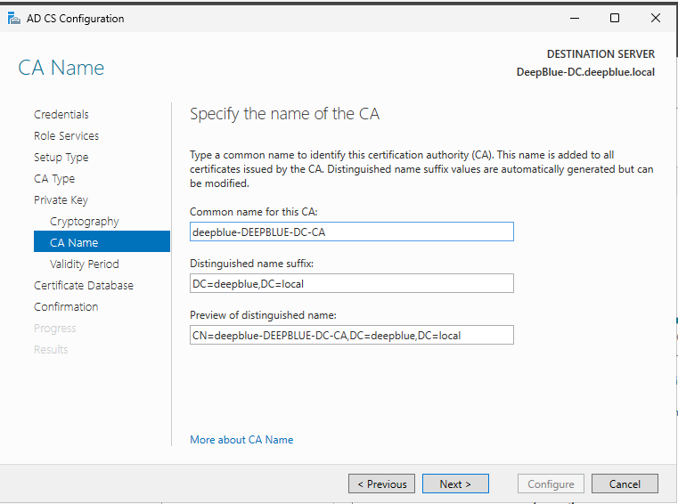
 
 
We can now create a group called '_ADMINS' and add our own domain admin 'a-ptrident':  
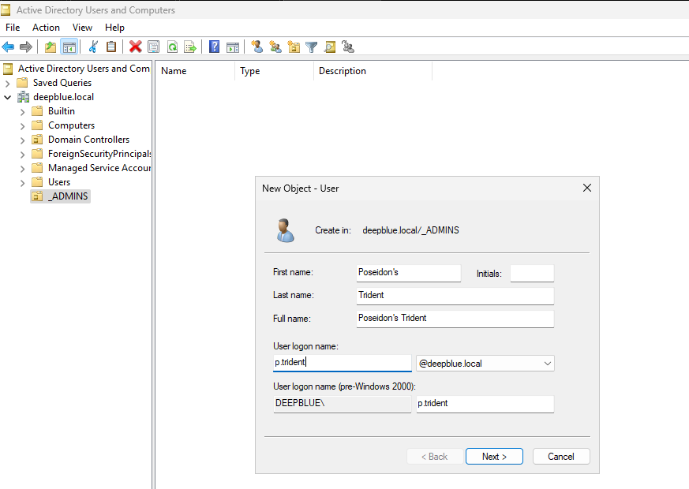
 
 
Next, we can add Remote Access and Routing for any kind of remote connectivity for employees. I've configured DHCP to assign an ip within the 172.16.0.100-200 range with a DNS gateway of 172.16.0.1 (DC IP) The idea was to allow internet access on workstations through the domain controller:  

 
 
Setting up the Windows 11 Enterprise workstation called 'Abyss-WS1'. I'll have it connect to our deepblue.local domain:  
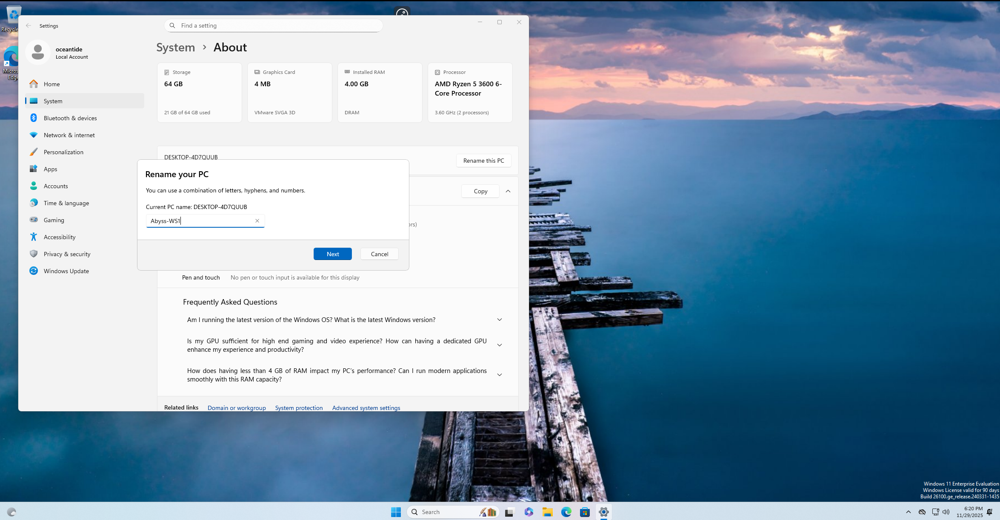
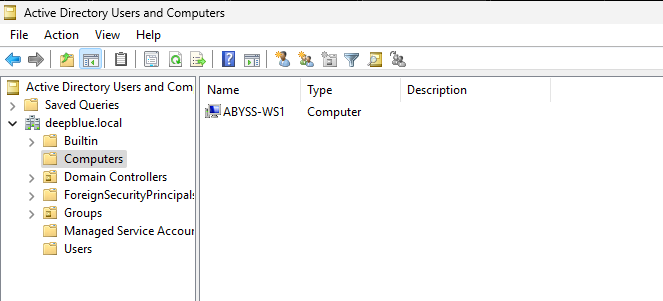
 
 
I created a couple of shares that will end up being part of the CTF later on. In this screenshot, I created a share called 'IT Share' to showcase its creation on the domain, but later changed it to 'Public':  
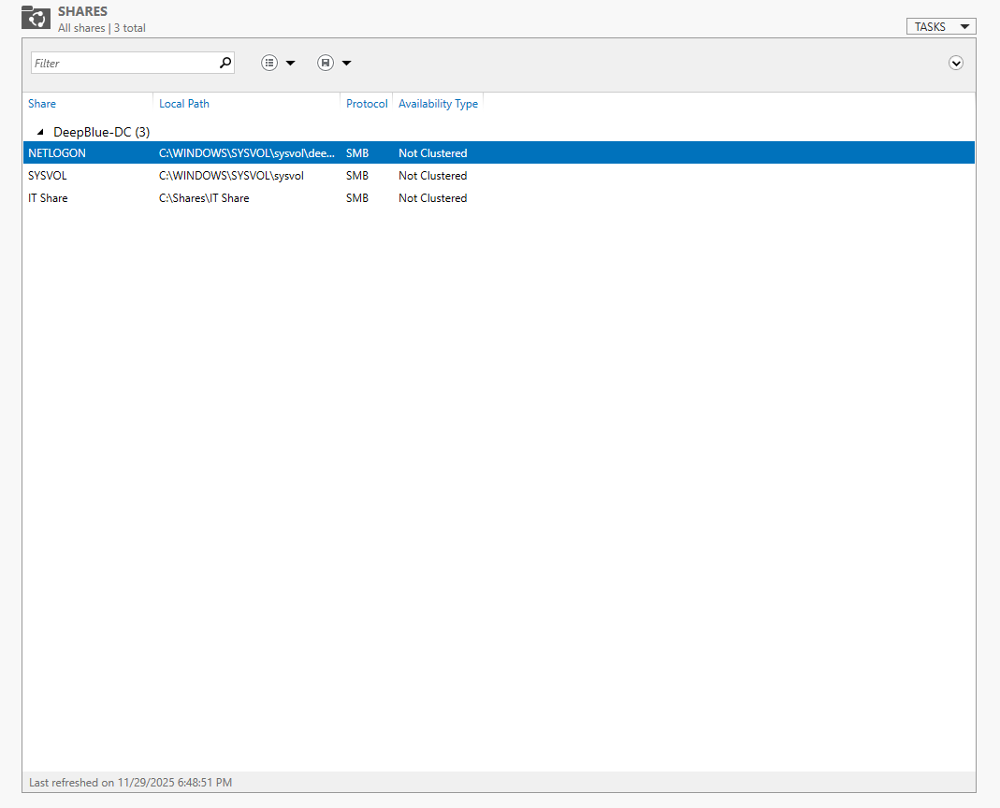
 
 

<h2>Offensive Simulation : FOR EDUCATION PURPOSES ONLY - </h2>
I launched a man-in-the-middle called 'Responder' that will send LLMNR/NBT-NS poisoning requests to the DC and workstations in hopes of an 'employee' would try to access a share that doesn't exist. As a pentester, you would run this attack in the morning or at lunch where a lot of network traffic is present. Employees, especially early morning, are prone to making typos or misclicks when attempting to access shares. For example, employee may type 'Pyblic' on a share named 'Public' and that'll trigger a response.  
 
 

Nmap scans for target validation and port scanning:  
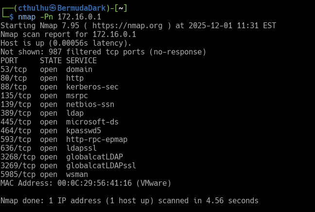
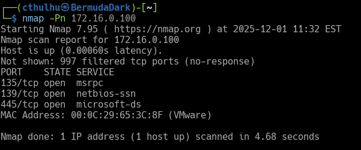
 
 
Here I'll launch responder on a kali linux machine. The first image will show a user account attempt to access the 'Public' share misspelled, and responder will capture the forced authenticated NTLM hash:  
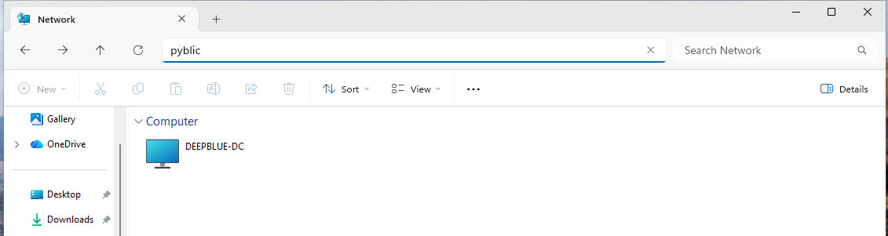
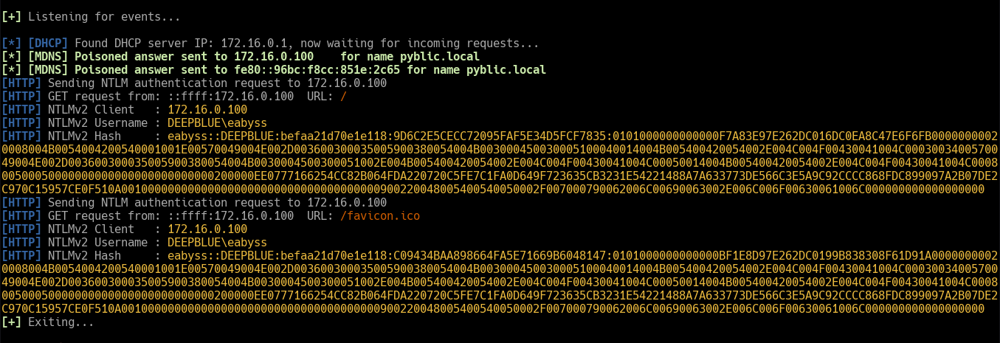
 
 
We can run hashcat to brute-force a match against common passwords found in rockyou.txt. Next, we can validate the credentials and shares using netexec:  
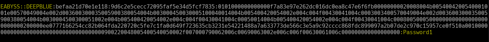
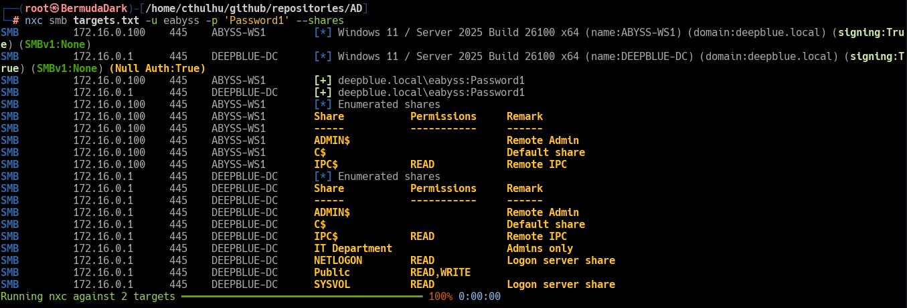
 
 
Accessing the share and discovering a file called 'pass.txt' (simulate information disclosure via plaintext passwords):  
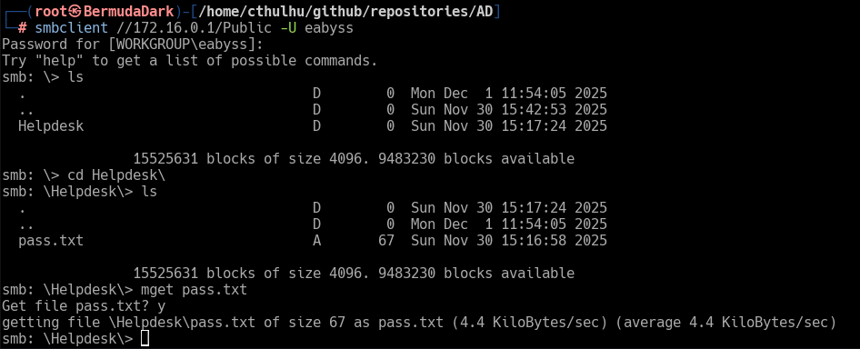
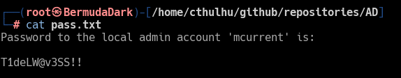
 
 
And, again, abusing information disclosure by discovering domain admin creds in a txt file:  
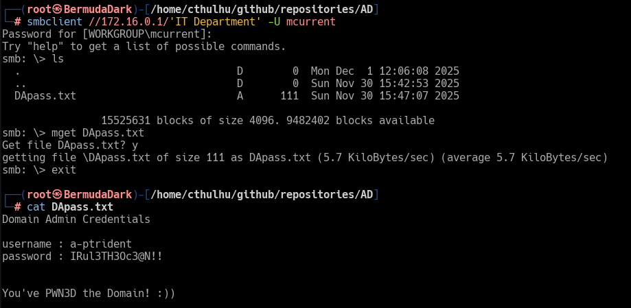
 
 

<h2>Mitigation Steps:</h2>

Since the initial compromise was a Link Local Multicast Name Resolution (LLMNR) poisoning scheme, we want to disable LLMNR by adding a GPO and enforcing it on the domain. On the workstation, we can run 'gpoupdate /force' to update policies on it:  
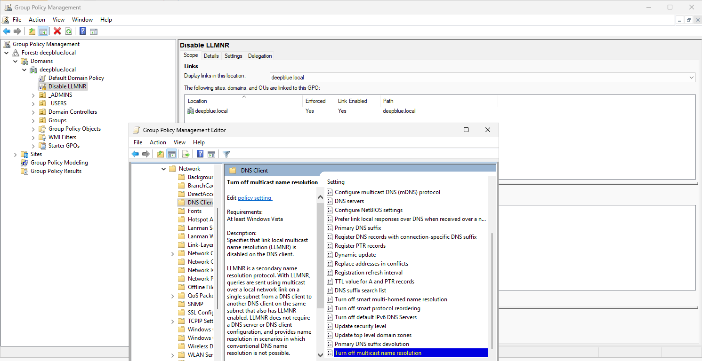
 
 
We can also remove any kind of plaintext files that could be leveraged against our domain and urge employees to refrain from storing credentials as such. In addition, we could set up a PAM solution and apply complexity rules and requirements so that user's aren't prone to making passwords as easy as 'Password1', making it harder to crack. 

